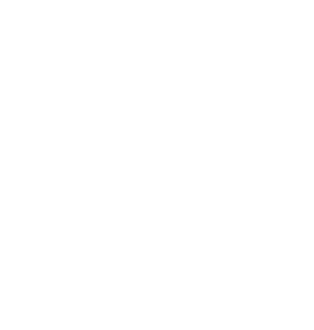

# Tooltip creator

Tooltip SVG creation library.



## Documentation

```ts
export function tooltip (options: {
  /**
   * The tooltip width without the arrow.
   */
  width: number
  /**
   * The tooltip height without the arrow.
   */
  height: number
  /**
   * The corner radius of the tooltip.
   * Can be a number for the same radius or an object with the radius of each corner.
   */
  cornerRadius: number | CornerRadius
  /**
   * The information about the arrow. Optional. Do not set it if you don't want any arrow.
   */
  arrow?: {
    /**
     * The arrow position. Values can be "top", "right", "bottom" or "left".
     */
    position: ArrowPosition
    /**
     * The base of the arrow.
     */
    base: number
    /**
     * The height of the arrow.
     */
    height: number
    /**
     * The start position of the arrow.
     * For left or right position, x position from the left.
     * For top or bottom position, y position from the top.
     */
    start: number
  },
  /**
   * The fill color of the tooltip and arrow.
   */
  fillColor: string
  /**
   * Shadow definitions
   */
  shadow?: {
    /**
     * Size of the shadow. Set 0 for no shadow.
     */
    size: number
    /**
     * Shadow color.
     * Default is black.
     */
    color?: string
    /**
     * Opacity. Between 0 and 1.
     * Default is 0.5.
     */
    opacity?: number
    /**
     * Shadow position offset from center.
     * Default is { x: 0, y: 0 }
     */
    offset?: { x: number, y: number }
  }
}): {
  /**
   * The content of the SVG file
   */
  svg: string
  /**
   * The content insents. Use it as the minimum padding of the content.
   */
  insets: { top: number, right: number, bottom: number, left: number }
  /**
   * The total size of the SVG
   */
  size: {
    width: number
    height: number
  }
} 
}
```

## Example

```ts
const { svg } = tooltip({
    width: 300,
    height: 300,
    shadow: {
      size: 20,
      opacity: 0.5,
      color: 'rgb(0, 0, 0)',
      offset: { x: 0, y: 0 }
    },
    fillColor: 'white',
    cornerRadius: {
      upperLeft: 10,
      upperRight: 5,
      lowerLeft: 30,
      lowerRight: 5
    },
    arrow: {
      position: 'top',
      base: 40,
      height: 20,
      start: 25
    }
  })
```

Will generate this SVG

```xml
<?xml version="1.0" encoding="UTF-8"?>
  <svg width="380px" height="400px" viewBox="0 0 380 400" version="1.1" xmlns="http://www.w3.org/2000/svg" xmlns:xlink="http://www.w3.org/1999/xlink">
      <defs>
          <path d="M 50,60 L 65,60 L 85,40 L 105,60 L 335,60 Q 340,60 340,65 L 340,330 Q 340,360 310,360 L 45,360 Q 40,360 40,355 L 40,70 Q 40,60 50,60 Z" id="tooltip"></path>
          <filter id="shadow" x="-13.333333333333334%" y="-13.333333333333334%" width="126.66666666666667%" height="126.66666666666667%">
            <feOffset result="offOut" in="SourceGraphic" dx="0" dy="0" />
            <feColorMatrix result="matrixOut" in="offOut" type="matrix"
            values="0.2 0 0 0 0 0 0.2 0 0 0 0 0 0.2 0 0 0 0 0 1 0" />
            <feGaussianBlur result="blurOut" in="matrixOut" stdDeviation="20" />
            <feBlend in="SourceGraphic" in2="blurOut" mode="normal" />
        </filter>
      </defs>
      <g>
        <use fill="white" fill-rule="evenodd" xlink:href="#tooltip" filter="url(#shadow)"></use>
      </g>
  </svg>
```


## Try It!

You can try the library [here](https://rawgit.com/jaeggerr/tooltip-creator/master/example/index.html).